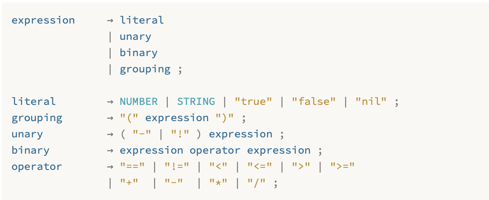
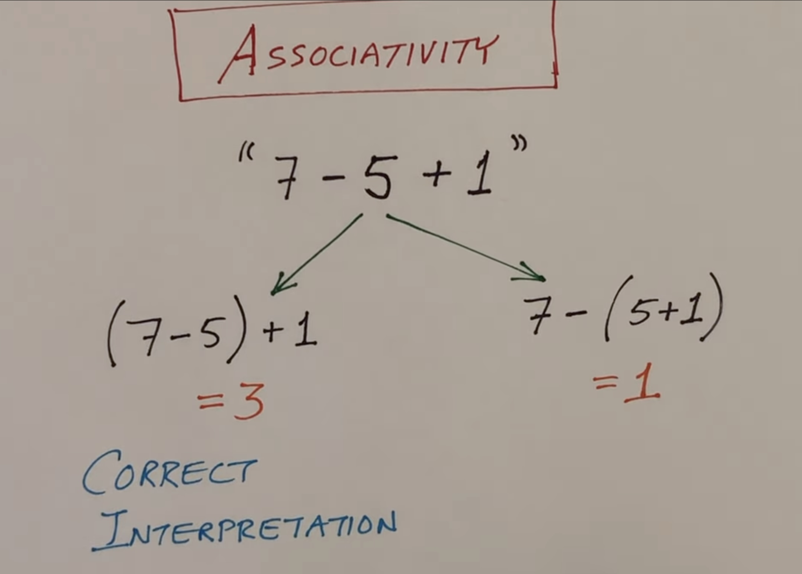

[![42](https://img.shields.io/badge/-Berlin-blue.svg?logo=data:image/svg%2bxml;base64,PD94bWwgdmVyc2lvbj0iMS4wIiBlbmNvZGluZz0idXRmLTgiPz4NCjwhLS0gR2VuZXJhdG9yOiBBZG9iZSBJbGx1c3RyYXRvciAxOC4xLjAsIFNWRyBFeHBvcnQgUGx1Zy1JbiAuIFNWRyBWZXJzaW9uOiA2LjAwIEJ1aWxkIDApICAtLT4NCjxzdmcgdmVyc2lvbj0iMS4xIg0KCSBpZD0iQ2FscXVlXzEiIHNvZGlwb2RpOmRvY25hbWU9IjQyX2xvZ28uc3ZnIiBpbmtzY2FwZTp2ZXJzaW9uPSIwLjQ4LjIgcjk4MTkiIHhtbG5zOnJkZj0iaHR0cDovL3d3dy53My5vcmcvMTk5OS8wMi8yMi1yZGYtc3ludGF4LW5zIyIgeG1sbnM6c3ZnPSJodHRwOi8vd3d3LnczLm9yZy8yMDAwL3N2ZyIgeG1sbnM6c29kaXBvZGk9Imh0dHA6Ly9zb2RpcG9kaS5zb3VyY2Vmb3JnZS5uZXQvRFREL3NvZGlwb2RpLTAuZHRkIiB4bWxuczpkYz0iaHR0cDovL3B1cmwub3JnL2RjL2VsZW1lbnRzLzEuMS8iIHhtbG5zOmNjPSJodHRwOi8vY3JlYXRpdmVjb21tb25zLm9yZy9ucyMiIHhtbG5zOmlua3NjYXBlPSJodHRwOi8vd3d3Lmlua3NjYXBlLm9yZy9uYW1lc3BhY2VzL2lua3NjYXBlIg0KCSB4bWxucz0iaHR0cDovL3d3dy53My5vcmcvMjAwMC9zdmciIHhtbG5zOnhsaW5rPSJodHRwOi8vd3d3LnczLm9yZy8xOTk5L3hsaW5rIiB4PSIwcHgiIHk9IjBweCIgdmlld0JveD0iMCAtMjAwIDk2MCA5NjAiDQoJIGVuYWJsZS1iYWNrZ3JvdW5kPSJuZXcgMCAtMjAwIDk2MCA5NjAiIHhtbDpzcGFjZT0icHJlc2VydmUiPg0KPHBvbHlnb24gaWQ9InBvbHlnb241IiBwb2ludHM9IjMyLDQxMi42IDM2Mi4xLDQxMi42IDM2Mi4xLDU3OCA1MjYuOCw1NzggNTI2LjgsMjc5LjEgMTk3LjMsMjc5LjEgNTI2LjgsLTUxLjEgMzYyLjEsLTUxLjEgDQoJMzIsMjc5LjEgIi8+DQo8cG9seWdvbiBpZD0icG9seWdvbjciIHBvaW50cz0iNTk3LjksMTE0LjIgNzYyLjcsLTUxLjEgNTk3LjksLTUxLjEgIi8+DQo8cG9seWdvbiBpZD0icG9seWdvbjkiIHBvaW50cz0iNzYyLjcsMTE0LjIgNTk3LjksMjc5LjEgNTk3LjksNDQzLjkgNzYyLjcsNDQzLjkgNzYyLjcsMjc5LjEgOTI4LDExNC4yIDkyOCwtNTEuMSA3NjIuNywtNTEuMSAiLz4NCjxwb2x5Z29uIGlkPSJwb2x5Z29uMTEiIHBvaW50cz0iOTI4LDI3OS4xIDc2Mi43LDQ0My45IDkyOCw0NDMuOSAiLz4NCjwvc3ZnPg0K)](https://42berlin.de) [](https://github.com/multitudes/42-minishell/actions/workflows/main.yml) [](https://opensource.org/licenses/MIT)   


# Project: 42-minishell
> "The number of UNIX installations has grown to 10, with more expected." (The UNIX Programmer's Manual, 2nd Edition, June, 1972.)


This team project is about creating a simple shell.

We will be inspired by Bash. Bash is an acronym for ‘Bourne-Again SHell’.  

## What is a shell?
A shell is a program that acts as an interface between the user and the operating system. A shell allows the user to interact with the operating system by accepting commands entered by the user from the keyboard, verifying if the inputs from the user are correct and executing them. Generally, a shell is a user interface that allows us to use computer resources such as memory. Think of a command-line interface such as Bash of Fish.

The bash manual describes a shell as follows:

- A shell allows execution of GNU commands, both synchronously and asynchronously. The shell waits for synchronous commands to complete before accepting more input; asynchronous commands continue to execute in parallel with the shell while it reads and executes additional commands. The redirection constructs permit fine-grained control of the input and output of those commands. Moreover, the shell allows control over the contents of commands’ environments.

- Shells also provide a small set of builtin commands (builtins) implementing functionality impossible or inconvenient to obtain via separate utilities. For example, cd, break, continue, and exec cannot be implemented outside of the shell because they directly manipulate the shell itself. The history, getopts, kill, or pwd builtins, among others, could be implemented in separate utilities, but they are more convenient to use as builtin commands.

- Shells may be used interactively or non-interactively. In interactive mode, they accept input typed from the keyboard. When executing non-interactively, shells execute commands read from a file.

### Some more definitions from the bash manual
- POSIX  A family of open system standards based on Unix.
- builtin A command that is implemented internally by the shell itself, rather than by an executable program somewhere in the file system.
- control operator : A token that performs a control function. It is a newline or one of the following: ‘||’, ‘&&’, ‘&’, ‘;’, ‘;;’, ‘;&’, ‘;;&’, ‘|’, ‘|&’, ‘(’, or ‘)’.
- exit status : The value returned by a command to its caller. The value is restricted to eight bits, so the maximum value is 255.
- metacharacter: A character that, when unquoted, separates words. A metacharacter is a space, tab, newline, or one of the following characters: ‘|’, ‘&’, ‘;’, ‘(’, ‘)’, ‘<’, or ‘>’.
- operator : A control operator or a redirection operator.
- reserved word: A word that has a special meaning to the shell. Most reserved words introduce shell flow control constructs, such as for and while. (not strictly enforced by the shell)
- signal : A mechanism by which a process may be notified by the kernel of an event occurring in the system.
- token:  A sequence of characters considered a single unit by the shell. It is either a word or an operator.
- word A sequence of characters treated as a unit by the shell. Words may not include unquoted metacharacters.

### Shell Syntax (from the BASH manual)

When the shell reads input, it proceeds through a sequence of operations. If the input indicates the beginning of a comment, the shell ignores the comment symbol (‘#’), and the rest of that line.

Otherwise, roughly speaking, the shell reads its input and divides the input into words and operators, employing the quoting rules to select which meanings to assign various words and characters.

The shell then parses these tokens into commands and other constructs, removes the special meaning of certain words or characters, expands others, redirects input and output as needed, executes the specified command, waits for the command’s exit status, and makes that exit status available for further inspection or processing.

## Allowed functions

Here at 42 we are allowed to use the following functions for this project:

| Function | Description |
| -------- | ----------- |
| `execve()` | Executes a program specified by a filename. |
| `readline()` | Reads a line from the standard input and returns it as a string. |
| `rl_clear_history()` | Clears the history list maintained by the GNU Readline library. |	
| `rl_on_new_line()` | Tells the GNU Readline library that the cursor has moved to a new line. |
| `rl_replace_line()` | Replaces the current line with a new line. |
| `rl_redisplay()` | Updates the display to reflect the current contents of the line buffer. |
| `add_history()` | Adds a line to the history list maintained by the GNU Readline library. |
| `printf()` | Writes output to the standard output stream. |
| `malloc()`	| Allocates memory dynamically. |
| `free()` | Deallocates memory previously allocated by a call to malloc. |
| `write()` | Writes data to a file descriptor. |
| `access()` | Checks whether the calling process can access a file. |
| `open()` | Opens a file or device. |
| `read()` | Reads data from a file descriptor. |
| `close()` | Closes a file descriptor. |
| `fork()` | Creates a new process by duplicating the calling process. |
| `wait()` | Waits for a child process to terminate. |
| `waitpid()`  | Waits for a specific child process to terminate. |
| `wait3()` | Waits for any of the children process to terminate and returns resource usage information. |
| `wait4()` | Waits for a child process (passing its pid) to terminate and returns resource usage information. | 	
| `signal()` | Sets a signal handler for a specific signal. |
| `sigaction()` | Sets a signal handler for a specific signal. |
| `sigemptyset()` | Initializes an empty signal set. |
| `sigaddset()` | Adds a signal to a signal. |
| `kill()` | Sends a signal to a process. |
| `exit()` | Terminates the calling process. |
| `getcwd()` | Gets the current working directory. |
| `chdir()` | Changes the current working directory. |
| `stat()` | Gets file status. |
| `lstat()` | Gets file status. The file is a symbolic link. |
| `fstat()` | Gets status of the file pointed to from a file descriptor. |
| `unlink()` | Deletes a name from the filesystem. |
| `dup()` | creates a copy of the given file descriptor. The new descriptor is the lowest-numbered file descriptor not currently open for the proces |
| `dup2()` | Duplicates a file descriptor, but it takes an additional argument: the desired file descriptor number for the copy. |
| `pipe()` | Creates a pipe.  |
| `opendir()` | Opens a directory stream. |	
| `readdir()` | Reads a directory stream. |
| `closedir()` | Closes a directory stream. |
| `strerror()` | Returns a string describing an error code. |
| `perror()` | Prints a descriptive error message to the standard error stream. |
| `isatty()` | Checks whether a file descriptor refers to a terminal. |
| `ttyname()` | Returns the name of the terminal connected to a file descriptor. |
| `ttyslot()` | Returns the number of the slot in the utmp file associated with the current process. |
| `ioctl()` | Performs device-specific operations. |
| `getenv()` | Gets the value of an environment variable. |
| `tcsetattr()` | Sets the parameters associated with a terminal. |
| `tcgetattr()` | Gets the parameters associated with a terminal. |
| `tgetent()` | Gets the entry in the terminfo database. |
| `tgetflag()` | Gets the value of a terminfo flag. |
| `tgetnum()` | Gets the value of a terminfo number. |
| `tgetstr()` | Gets the value of a terminfo string. |
| `tgoto()` | Instantiates the output of a given capability with parameters. |
| `tputs()`	| Outputs a string to the terminal. |

Also we follow the NORM, a series of rules about linting and formatting of the code. Examples: functions cannot have more than 25 lines; we are not allowed to use "for"-loops, but while loops are allowed; declaring and defining variables in one line is not allowed. etc.

## Builtin functions to recreate
Builtin commands are special commands that are implemented in the shell itself rather than being external programs. Some common builtin commands include cd, echo, and exit. Builtin commands such as “cd” or “exit” cannot be executed using the `execve()` function. Our minishell shall have the following Builtins which we need to recreate:
◦ echo with option -n
◦ cd with only a relative or absolute path 
◦ pwd with no options
◦ export with no options
◦ unset with no options
◦ env with no options or arguments
◦ exit with no options

Bash and other shalls have many more builtin commands.

The functionality of the builtin commands is described in the BASH manual and a short summary provided in the following.

### Builtin: `echo [-n] [arg ...]`
(_Bash builtin command_)
Output `args` separated by spaces and terminated with a newline. With `-n` option trailing newline is suppressed.
Just `echo` prints a newline. `echo -n` prints nothing. `echo -n "hello"` prints `hello` without a newline.  `echo -n -nnnn` prints nothing.  
`echo -n -nwhy` prints `-nwhy`. (dont ask me why :) but I think it is since the flag is not recognized as a flag but as a string). 
Return status is zero (usually since it is hard to fail!).  

### Builtin: `cd [directory]` (with relative or absolute path)
(_original Bourne Shell builtin_)
Used to change the current working directory to another directory. If directory is not specified the `HOME` shell variable is used. If directory is '-', it is converted to $OLDPWD before attempting directory change. 
Successful execution of `cd` should set `PWD` to new directory and `OLDPWD` to the working directory before the change.  
can fail if the directory is not existent. if the directory is not a directory. if the directory is not readable. if the directory is not searchable. if the directory is not writable. if the directory is not accessible. Errors are printed to stderr and can be like `cd: no such file or directory: /nonexistent` or `cd: permission denied: /root`.  
Return status is zero upon success, non-zero otherwise.

### Builtin: `pwd` (without options)
(_original Bourne Shell builtin_)
Prints the absolute pathname of the current working directory (can contain symbolic links though this may be implementation defined as the normally available options either explicitly prohibit symbolic links (`-P`) or explicitly allow symbolic links (`-L`).
Return status is zero unless an error is encountered while determining the name of the current directory (or an invalid option is supplied).

### Builtin: `export [name[=value]]` (without options)
(_original Bourne Shell builtin_)
Without any other options (as in our implementation) `name` refers to variables. Export allows to pass specified names/variable to be passed to child processes. When no names are provided, a list of all exported variables is displayed. When a value is provided after `name` and `=` the variable is set to `value`.
To note: "All values undergo tilde expansion, parameter and variable expansion, command substitution, arithmetic expansion, and quote removal." (see 3.4 Shell Parameters in the Bash Manual)
Return status is zero unless invalid option is supplied or one of the names is not a valid shell variable name.

To clarify: difference between environment variables and exported variables

### Builtin: `unset [name]` (without options)
(_original Bourne Shell builtin_)
Removes each variable or function with `name`.
> If no options are supplied, each name refers to a variable; if there is no variable by that name, a function with that name, if any, is unset. [...] Some shell variables lose their special behavior if they are unset.
Read-only variables and functions cannot be unset.
Return status is zero unless `name` is read-only or cannot not be unset.
To clarify: should we actually treat the removal/unsetting of functions? How do we identify read-only variables and functions?

### Builtin: `env` (without options or arguments)
`env` is not described as a builtin in the BASH manual. The variable $ENV is described related to POSIX variant of invoking shell.
Presumably env prints the current environment, i.e. the inherited environment plus any modifications through `export` and `unset`. 
From bash there is a way to start the minishell without any environment variables doing:  
```
env -i ./minishell
```
We check for this eventuality too. the env will have only the PWD PATH _ and SHLVL variables.

### Builtin: `exit [n]` (without options)
(_original Bourne Shell builtin_)
The builtin command `exit`,- as the name implies -, exits the shell. The exit status is of type uint8_t and shall be set to that of the last executed command.  
The BASH builtin allows optionally to set the exit status as an argument ([n]) which will be cast to the uint8_t type..

# Teamwork - It's about GIT
## Commit style
>  Treat your codebase like a good camper does their campsite: always try to leave it a little better than you found it.  - Bob Nystrom

See https://www.conventionalcommits.org/en/v1.0.0/#summary.  

The commit message should be structured as follows:

```
<type>[optional scope]: <description>

[optional body]

[optional footer(s)]
```
The commit contains the following structural elements, to communicate intent to the consumers of your library:

> `fix:` a commit of the type fix patches a bug in your codebase (this correlates with PATCH in Semantic Versioning).
`feat:` a commit of the type feat introduces a new feature to the codebase (this correlates with MINOR in Semantic Versioning).  
`BREAKING CHANGE:` a commit that has a footer BREAKING CHANGE:, or appends a ! after the type/scope, introduces a breaking API change (correlating with MAJOR in Semantic Versioning). A BREAKING CHANGE can be part of commits of any type.  
types other than fix: and feat: are allowed, for example @commitlint/config-conventional (based on the Angular convention) recommends build:, chore:, ci:, docs:, style:, refactor:, perf:, test:, and others.  
footers other than BREAKING CHANGE: <description> may be provided and follow a convention similar to git trailer format.  
Additional types are not mandated by the Conventional Commits specification, and have no implicit effect in Semantic Versioning (unless they include a BREAKING CHANGE). A scope may be provided to a commit’s type, to provide additional contextual information and is contained within parenthesis, e.g., feat(parser): add ability to parse arrays.  

## Git pull --rebase
It depends of the team's preference but using this command will avoid doing a merge.
```
git pull --rebase
```
I also added it to my git aliases like
```
git config --global alias.pr 'pull --rebase'
```
If git pull rebase should fail, it is easy to back up with 
```
git rebase --abort
```
and pull normally or solve the conflicts.

## Ideas
### Architecture
A well defined architecture is a better experience for team work, but it doesnt come free, takes work and modularity is key. But when modularity doesn’t end up being helpful, it quickly becomes actively harmful and it spirals out of control.

### Decoupling
A part of creating a good architecture is decoupling. Decoupling is the process of separating the different parts of a system so that they are not dependent on each other. This makes the system more flexible and easier to maintain.
Our minishell will be divided into a few main parts:
- The scanner or lexemer, which splits the input into tokens.
- The parser, which takes the tokens, and builds/employs a data structure that represents the command(s) to be executed.
- The analyser/expander, which expands variables and expressions.
- The executer, which takes the data structure produced by the parser and expanded by the analyser and executes the command(s) it represents.
Furthermore we use integration tests and unit tests: To be able to make changes and refactor our code with confidence, we will need to have a suite of tests that we can run to ensure that our shell is working as expected.

## The road map
- we start by implementing a loop that reads the user input with the readline() function. The readline function is part of the part of the GNU Readline library and offers other functions like rl_clear_history, rl_on_new_line, rl_replace_line, rl_redisplay,add_history that we are allowed to use in our project.
- The first step is scanning, also known as lexing, or (if you’re trying to impress someone) lexical analysis.
- A scanner (or lexer) takes in the linear stream of characters and chunks them together into a series of something more akin to “words”. In programming languages, each of these words is called a token. Some tokens are single characters, like ( and , . Others may be several characters long, like numbers ( 123 ), string literals ( "hi!" ), and identifiers ( min ).
- The next step is parsing. This is where our syntax gets a grammar—the ability to compose larger expressions and statements out of smaller parts. 
A parser takes the flat sequence of tokens and builds a tree structure that mirrors the nested nature of the grammar. These trees have a couple of different names—“parse tree” or “abstract syntax tree”In practice, language hackers usually call them “syntax trees”, “ASTs”, or often just “trees”.
- Everything up to this point is considered the front end of the implementation.
- Tree-walk interpreters 
 To run the program, the interpreter traverses the syntax tree one branch and leaf at a time, evaluating each node as it goes.
- we have a number of builtins we will implement. These are 
◦ echo with option -n
◦ cd with only a relative or absolute path 
◦ pwd with no options
◦ export with no options
◦ unset with no options
◦ env with no options or arguments
◦ exit with no options

- Our shell should also have a working history.

## Grammar as foundation
The syntax of a programming language is defined by a grammar. The syntax of a programming language is a precise description of all its grammatically correct programs. Noam Chomsky defined four categories of grammars: regular, context-free, context- sensitive, and unrestricted.

## Inspiration: Context Free Grammar (CFG). 
A formal grammar takes a set of atomic pieces it calls its “alphabet”. Then it defines a (usually infinite) set of “strings” that are “in” the grammar. Each string is a sequence of “letters” in the alphabet.

A grammar naturally describes the hierarchical structure of most programming language constructs. For example, an if-else statement in Java can have  
`if (expression) statement else statement`
That is, an if-else statement si the concatenation of the keyword if, an opening parenthesis, an expression, a closing parenthesis, a statement, the keyword else, and another statement. Using the variable expr to denote an expres- sion and the variable stmt to denote a statement, this structuring rule can be expressed as  
`stmt →if (expr) stmt else stmt`

If you start with the rules, you can use them to generate strings that are in the grammar. Strings created this way are called derivations because each is “derived” from the rules of the grammar. In each step of the game, you pick a rule and follow what it tells you to do. Most of the lingo around formal grammars comes from playing them in this direction. Rules are called productions because they produce strings in the grammar.
Each production in a context-free grammar has a head—its name—and a body which describes what it generates. In its pure form, the body is simply a list of symbols. Symbols come in two delectable flavors:
A terminal is a letter from the grammar’s alphabet. You can think of it like a literal value. In the syntactic grammar we’re defining, the terminals are individual lexemes—tokens coming from the scanner like if or 1234.
These are called “terminals”, in the sense of an “end point” because they don’t lead to any further “moves” in the game. You simply produce that one symbol.
A nonterminal is a named reference to another rule in the grammar. It means “play that rule and insert whatever it produces here”. In this way, the grammar composes.

To make this concrete, we need a way to write down these production rules. People have been trying to crystallize grammar all the way back to Pāṇini’s Ashtadhyayi, which codified Sanskrit grammar a mere couple thousand years ago. Not much progress happened until John Backus and company needed a notation for specifying ALGOL 58 and came up with Backus-Naur form.

I really liked the explanation of context-free grammar in the book Crafting Interpreters by Rob Nystrom. Looking in chapter 4 of the book, he explains that the first step is scanning.

> Scanning is a good starting point for us too because the code isn’t very hard—pretty much a switch statement with delusions of grandeur.

A scanner (or lexer) takes in the linear stream of characters and chunks them together into a series of something more akin to “words”. In programming languages, each of these words is called a token. Some tokens are single characters, like ( and , . Others may be several characters long, like numbers ( 123 ), string literals ( "hi!" ), and identifiers ( min ). The next step is parsing. This is where our syntax gets a grammar—the ability to compose larger expressions and statements out of smaller parts. A parser takes the flat sequence of tokens and builds a tree structure that mirrors the nested nature of the grammar. These trees have a couple of different names—“parse tree” or “abstract syntax tree”. In practice, language hackers usually call them “syntax trees”, “ASTs”, or often just “trees”. Everything up to this point is considered the front end of the implementation. The back end is where the interpreter actually runs the program. There are a few different ways to do this, but the most common is tree-walk interpreters. To run the program, the interpreter traverses the syntax tree one branch and leaf at a time, evaluating each node as it goes.

## Grammar of a shell
We need to create our grammar. To do so we head to our Bash manual!

Some of the tokens that are of interest to us:

| Token | Definition |
| -- | -- |
| blank | A space or tab character. |
| word | A sequence of characters considered as a single unit by the shell. Also known as a token. |
| name | A word consisting only of alphanumeric characters and underscores, and beginning with an alphabetic character or an underscore. Also referred to as an identifier. |
| metacharacter | A character that, when unquoted, separates words. A metacharacter is a space, tab, newline, or one of the following characters: '\|', '&', ';', '(', ')', '<', or '>'. |
| control operator | A token that performs a control function. It is a newline or one of the following: '\|\|', '&&', '&', ';', ';;', ';&', ';;&', '\|', '\|&', '(', or ')'. |
| operator | A sequence of characters considered a single unit by the shell. It is either a word or an operator. |
| reserved word | A word that has a special meaning to the shell. Most reserved words introduce shell flow control constructs, such as loops or conditionals. The reserved words recognized by the shell are: `! case esac do done if elif else fi for  in then until while { } time [[ ]]`

Also there is the question of priority:

- && and || have the same precedence and are left-associative. They allow you to execute a command based on the success (&&) or failure (||) of the previous command.  
- ; and & have the same precedence, which is lower than && and ||. They allow you to separate commands (;) or run a command in the background (&).  
- | and |& have higher precedence than &&, ||, ;, and &. They allow you to create pipelines, where the output of one command is used as the input of the next command (|), or where both the output and error output of one command are used as the input of the next command (|&).  
- ( and ) can be used to group commands, which can override the default precedence rules.  
- ;;, ;&, and ;;& are used in the context of a case statement to separate different cases.  
- [[ and ]] are used for conditional expressions.  
- { and } are used to group commands in a block.

How do we write down a grammar that contains an infinite number of valid strings? We obviously can’t list them all out. Instead, we create a finite set of rules.  
This is from the book Crafting Interpreters by Bob Nystrom. He explains that a grammar naturally describes the hierarchical structure of most programming language constructs. For example:


## Grammar of our shell
This is a good starting point for our grammar.
Through reading the shell grammar page (link below) I got a better understanding of how to write the grammar for our shell and came up with the following:
```
grammar:
to get the final table
list    	  	-> pipeline (";" | "&" | "&&" | "||") pipeline)* [";"] | ["&"] ["\n"]
					| "(" list ")";
pipeline	 	->  command  (("|" | "|&" | ";" | "&&" | "||" )command)* ;
					| "(" list ")";
command		 	->  simple_command 
					| builtin 
					| DLESS 
					| redirection
					| [time [-p]] [!] expression
					| "(" list ")";

simple_command	-> name (args)* ;
builtin 		-> name (args)* ; 
redirection		-> expression ( "<" | ">" | ">>" | ">>&" | "2>" | "&> | &>> | 2>> | <> | >|") expression; 
DLESS 			-> expression "<<" delimiter newline content delimiter;

delimiter 		-> STRING;
content 		-> MULTIPLE_LINE_TEXT;
flags 			-> FLAGS;
name 			-> WORD | COM_EXPANSION | VAR_EXPANSION;
args 			-> FLAGS | WORD | STRING | QUOTED_STRING | SIMPLE_QUOTED_STRING | VAR_EXPANSION | EXPR_EXPANSION;

```
Where DLESS is the heredoc operator, and the other operators are the redirection operators.

## Lexemes
Our job is to scan through the list of characters and group them together into the smallest sequences that still represent something. Each of these blobs of characters is called a lexeme.
example of lexeme
```
typedef enum e_tokentype {
	WORD,  // Any sequence of letters, digits, and underscores
	NUMBER, // like 42 42.42 -2 etc 
	BUILTIN,
	FLAGS,
	PATHNAME, 
	PIPE, // | - | and |& have higher precedence than &&, ||, ;, and &. 

	AND_IF, 	// &&
	OR_IF, // || 
	...
} t_tokentype;
```

## Parentheses
```
cat ("hey")
bash: syntax error near unexpected token `('
```
When not escaped or quoted, parentheses `(` and `)` in bash have special meanings and are treated as control operators. They cannot be used as part of an argument like a filename. Here are their main uses:

Ex: Commands enclosed between `(` and `)` are executed in a subshell, which is a separate instance of the shell.

```bash
(echo "Hello"; echo "World")
```
Then they are used in functions or for arithmetic operations, which we do not implement. 

So, when not escaped or quoted, parentheses cannot be part of an argument like a filename. They are treated as control operators and have special meanings.

## Variable names
Variables names have stricter rules than command or file names. 

They match like in C the regex pattern:
`[_a-zA-Z][[_0-9a-zA-Z]]*`
 
ex `export [_a-zA-Z][[_0-9a-zA-Z]]*=....`
so the var name should match the pattern `[_a-zA-Z][[_0-9a-zA-Z]]*` which means, start with letter or underscore and continue with same but allowing digits.

This is also mentioned in the book [crafting interpreters](https://craftinginterpreters.com/scanning.html) chapter 4.3

Therefore this is not possible:

```
export 234fsd=fjskld
```

And then we have an illustrative special case below. The expansion mostly happens in bash before the parsing in the tree (if any in bash).  
- var becomes HOME
- then when we unset $var because $var was previously expanded we get `unset HOME`
- when I do `export $var=home/rpriess` it is really `export HOME=home/rpriess` 

```
lbrusa@c3a4c7:/home/lbrusa/DEV/minishell$ export var=HOME        
lbrusa@c3a4c7:/home/lbrusa/DEV/minishell$ unset $var             
lbrusa@c3a4c7:/home/lbrusa/DEV/minishell$ export $var=home/rpriess
lbrusa@c3a4c7:/home/lbrusa/DEV/minishell$ env                     
PWD=/home/lbrusa/DEV/minishell
HOME=home/rpriess
var=HOME
SHLVL=1
PATH=/local/bin:/local/bin:/local/bin:/.local/bin:/usr/local/sbin:/usr/local/bin:/usr/sbin:/usr/bin:/sbin:/bin
_=/usr/bin/env
lbrusa@c3a4c7:/home/lbrusa/DEV/minishell$ 
```

## Tokens
### Metacharacters
A character that, when unquoted, separates words. A metacharacter is a space, tab, newline, or one of the following characters: ‘|’, ‘&’, ‘;’, ‘(’, ‘)’, ‘<’, or ‘>’.

A token that performs a control function. It is a newline or one of the following: ‘||’, ‘&&’, ‘&’, ‘;’, ‘;;’, ‘;&’, ‘;;&’, ‘|’, ‘|&’, ‘(’, or ‘)’.

A sequence of characters considered a single unit by the shell. It is either a word or an operator.

word
A sequence of characters treated as a unit by the shell. Words may not include unquoted metacharacters.

The core of the scanner is a loop. Starting at the first character of the source code, it figures out what lexeme it belongs to, and consumes it and any following characters that are part of that lexeme. When it reaches the end of that lexeme, it emits a token.

## Parsing
In order to evaluate an arithmetic node, you need to know the numeric values of its subtrees, so you have to evaluate those first. That means working your way from the leaves up to the root—a post-order traversal:If I gave you an arithmetic expression, you could draw one of these trees pretty easily.

## Allowed functions
### The readline function
The readline() function is not a standard C library function, but rather a function provided by the GNU Readline library.  

Here's a basic example:
```
#include <stdio.h>
#include <stdlib.h>
#include <readline/readline.h>

int main() {
    char *input;

    input = readline("Enter some text: ");

    if (input != NULL) {
        printf("You entered: %s\n", input);
		add_history(input); // Add the input to the history list
        free(input); // Free the memory allocated by readline
    }

    return 0;
}

```
need linking with `-lreadline` when compiling.
Using add_history() function, we add the input to the history list maintained by Readline. This allows users to recall and edit previously entered command lines using the up and down arrow keys. It seems that we are not allowed to use the history_list() function or the history_get() function therefore we will have to implement our own history list.

## On the mac m1 
I could get the readline and add_history functions to work on my mac m1. 
But to get the rl_clear_history to work I had to switch libraries. Apparently the readline on the mac is not complete. So using brew I installed the GNU readline and linked it to my project in the makefile using the path found with `brew --prefix readline` which in my system expands to `/opt/homebrew/opt/readline/`.
So my include path and LIBS path look like this:
```
INCLUDES += -I$(shell brew --prefix readline)/include
LDLIBS += -L$(shell brew --prefix readline)/lib  
```

### rl_clear_history
The rl_clear_history function is part of the GNU Readline library, and it is used to clear the history list maintained by Readline. The history list typically stores previously entered command lines, allowing users to recall and edit them.

## Structure and functional elements
### Phases of the interpreter: scanning, parsing, and evaluating code.

1. A scanner (or lexer) takes in the linear stream of characters and chunks them together into a series of something more akin to “words”. In programming languages, each of these words is called a token. Some tokens are single characters, like ( and , . Others may be several characters long, like numbers ( 123 ), string literals ( "hi!" ), and identifiers ( min )

2. The next step is parsing. This is where our syntax gets a grammar, the ability to compose larger expressions and statements out of smaller parts. A parser takes the flat sequence of tokens and builds a tree structure that mirrors the nested nature of the grammar.

3. ...

### Interactive and non-interactive shells and scripts

One important aspect to consider when creating a simple shell is whether it is running in interactive mode or non-interactive mode.

In interactive mode, the shell is running in a command line interface and accepts input from the user. This is the mode that most users will be familiar with, and it is important to display a prompt to the user so that they know when the shell is ready to accept input.

In non-interactive mode, the shell is being used to run a script or a batch of commands, and does not accept input from the user. In this mode, there is no need to display a prompt, and the shell should exit once it has executed all the commands in the script.

To check whether the shell is running in interactive mode or non-interactive mode, we can use the isatty() function. This function checks whether a file descriptor refers to a terminal or not. If it returns true, then the shell is running in interactive mode and we should display a prompt. If it returns false, then the shell is running in non-interactive mode and we should not display a prompt.

### Create an infinite loop for the prompt
we can display a prompt to the user. This input can be a single command or multiple commands separated by a semicolon. To read input from the user, we can use the getline function which reads a line of input from the user. 

### Parsing User Input

we will need to read the input from and split it into tokens. These tokens can then be analyzed to determine the command the user wants to execute and any arguments or options they have provided. 

### Executing Commands

This involves creating a child process to run the command and using system calls to execute it. To execute the command, we can use the 'execve()' function which executes a command by searching for the executable file in the system’s path environment variable. You will also need to handle any errors that may occur during command execution.  

### Handling the PATH

A path is a list of directories that the shell uses to search for executable files. When a user enters a command in the shell, the shell searches for the corresponding executable file in each directory listed in the path until it finds the executable.

One way to handle paths using a linked list is to create a data structure that stores the directories in the path.  

Once we have the linked list of directories, we can use it to search for executable files when a user enters a command in the shell. 

### Implement Built-In Commands

Builtin commands are special commands that are implemented by the shell itself rather than being external programs. Some common builtin commands include cd, echo, and exit. You will need to implement these commands yourself. Builtin commands such as “cd” or “exit” cannot be executed using the `execve()` function.  

### Support Input/Output Redirection

Input/output redirection allows the user to redirect the input or output of a command to a file instead of the screen or keyboard (standard input or output). To implement I/O redirection, we can use the dup2() function to redirect input or output to a file descriptor.
Redirection operators in Bash are used to control the input and output of commands. They allow you to manipulate where a command reads its input from and where it writes its output to. Here are some common redirection operators:

1. **`>` (Output Redirection):**
   - Redirects the output of a command to a file.
   - Example: `ls > output.txt`
   - This command lists the contents of the current directory and writes the output to a file named `output.txt`.

2. **`<` (Input Redirection):**
   - Takes the input for a command from a file.
   - Example: `sort < input.txt`
   - This command sorts the lines from the file `input.txt`.

3. **`>>` (Append Output):**
   - Appends the output of a command to a file (instead of overwriting it).
   - Example: `echo "new line" >> output.txt`
   - This command appends the text "new line" to the end of the file `output.txt`.

4. **`<<` (Here Document):**
   - Allows you to pass multiple lines of input to a command.
   - Example:
     ```bash
     cat << EOF
     Line 1
     Line 2
     EOF
     ```
     This command uses a here document to pass multiple lines to the `cat` command.

### Support Pipes

To implement pipes, we can use the pipe() function to create a pipe and the fork() function to create a child process for each command.

5. **`|` (Pipe):**
   - Connects the output of one command as the input to another command.
   - Example: `ls | grep "pattern"`
   - This command lists the files in the current directory and pipes the output to `grep` to filter lines containing the specified pattern.

this will not needed in our minishell but leaving it here for completeness:  

### Background Jobs 
(not to be implemented in this project)

Background jobs allow a command to be executed in the background, allowing the user to continue working in the shell while the command runs. 
example:
```
$ sleep 10 &
[1] 1234
$ 
```
After entering the command follwed by `&` the shell will display the process id of the background job and the job number.

### Error Handling

We distinguish fatal errors that require termination of the minishell (and freeing of all allocated memory ...) and errors that are noted to the user while program execution continues.

We check the return/exit value of system calls and library functions and store it in a global variable. After the last command is executetd we check the value of the global variable and update the environment variable `$?` with the value.

The shell should provide meaningful error messages to the user when a command fails. 

Examples of the types of errors that a simple shell may encounter and how they can be handled:
ex incorrect command,  incorrect number of arguments, permission denied, system call error, signal handling, memory allocation error, failed update of history etc.

| Error | How it is handled |
| -- | -- |
| ... | ... |
| Reading history file path from environment fails |  |
| Open history file path fails | | 
| Writing to history fails | |
| Updating environment with history input fails | |


## `strerror(errno)` and `perror` 

They are both used to print human-readable error messages, but they are used differently.  
`strerror(errno)` is a function that returns a pointer to a string that describes the error code passed in the argument errno. You can use it with `printf` to format and print the error message.

```c
printf("getcwd() error: %s\n", strerror(errno));
```

On the other hand, `perror` is a function that prints a descriptive error message to stderr. The argument you pass to `perror` is a string that is printed as a prefix to the error message.

```c
perror("getcwd() error");
```
So, if you want to use `perror` in your code, you don't need to use it inside `printf`. It prints the error message directly.

## Error Handling in C
Using system functions and library in C can be useful to use the functioms like `strerror()` and `perror()` to print errors. Most of these functions return a value to indicate success or failure, and set the `errno` variable to indicate the type of error that occurred.
For example the `getcwd()` function can fail in a few scenarios, and it sets the `errno` variable to indicate the type of error. Here are some possible error codes:

- `ENOMEM`: Insufficient memory to allocate the pathname string. This happens when `getcwd()` can't allocate memory for the pathname string.

- `ERANGE`: The size of the buffer is insufficient to store the pathname. This happens when the buffer size provided to `getcwd()` is smaller than the length of the absolute pathname of the working directory, including the terminating null byte.

- `EACCES`: Permission to read or search a component of the filename was denied. This happens when one of the directories in the pathname did not allow search (execute) permission.

- `EFAULT`: The buffer argument points outside the process's allocated address space.

Here's an example 
```c
#include <stdio.h>
#include <unistd.h>
#include <errno.h>
#include <string.h>

int main() {
    char buffer[1024];
    if (getcwd(buffer, sizeof(buffer)) == NULL) {
        printf("getcwd() error: %s\n", strerror(errno));
        return 1;
    }
    printf("Current working directory: %s\n", buffer);
    return 0;
}
```


### Signals
Signals are used by the operating system to notify a process of various events, such as a segmentation fault or a user interrupt. 

### Memory management and memory Leaks

   | Allocated memory | when to free? |
-- | ---------------- | ------------ |
1  | Array for environment information | upon error and when terminating program |
2  | Memory for strings read from environment in array | upon error, when updating environment and when terminating program |
3  | Main data struct | upon error and when terminating program |
4  | path for history file | immediately after accessing it with open() |
5  | data->input allocated by readline() in loop() | free after each call or after final call ? |
6  | Token list (linked list) | |
7  |  |  |

We use valgrind... On linux.
```
valgrind ./myprogram
```
with flags and options as appropriate.

## It is a huge project - Test the Shell

I have a suite of tests developed for this purpose. Unit tests can be used to test functions and components of the shell, while integration tests can be used to test the shell as a whole.

## The Bonus Part
> Your program has to implement:  
	• && and || with parenthesis for priorities.
	• Wildcards * should work for the current working directory.

Some examples of using `&&` (logical AND) and `||` (logical OR) with parentheses for priorities in Bash:

### Using `&&` (Logical AND):

1. **Basic `&&` Example:**
   ```bash
   command1 && command2
   ```
   - If `command1` succeeds (returns a zero exit status), then `command2` will be executed.

2. **Multiple Commands with `&&`:**
   ```bash
   (command1 && command2) && command3
   ```
   - `command1` and `command2` are executed in sequence. If both succeed, then `command3` is executed.

3. **Mixing `&&` and `||`:**
   ```bash
   (command1 && command2) || command3
   ```
   - If `command1` and `command2` succeed, then `command3` will not be executed. If either `command1` or `command2` fails, then `command3` will be executed.

### Using `||` (Logical OR):

1. **Basic `||` Example:**
   ```bash
   command1 || command2
   ```
   - If `command1` fails (returns a non-zero exit status), then `command2` will be executed.

2. **Multiple Commands with `||`:**
   ```bash
   (command1 || command2) || command3
   ```
   - `command1` is executed. If it fails, then `command2` is executed. If both fail, then `command3` is executed.

3. **Mixing `&&` and `||`:**
   ```bash
   (command1 || command2) && command3
   ```
   - If `command1` succeeds, then `command2` will not be executed, and `command3` will be executed. If `command1` fails, then `command2` is executed, and `command3` will not be executed.

Wildcards, such as `*`, are used for pattern matching in file names. Here are some examples of using wildcards in the current working directory:

1. **List all files in the current directory:**
   ```bash
   ls *
   ```
   - This command lists all files (and directories) in the current directory.

2. **Remove all text files in the current directory:**
   ```bash
   rm *.txt
   ```
   - This command removes all files with a `.txt` extension in the current directory.

3. **Copy all `.jpg` files to another directory:**
   ```bash
   cp *.jpg /path/to/destination/
   ```
   - This command copies all files with a `.jpg` extension to the specified destination directory.

4. **Count the lines in all `.log` files:**
   ```bash
   wc -l *.log
   ```
   - This command counts the number of lines in each file with a `.log` extension in the current directory.

5. **Grep for a specific pattern in all `.md` files:**
   ```bash
   grep "pattern" *.md
   ```
   - This command searches for the specified pattern in all files with a `.md` extension.

These examples demonstrate how wildcards can be used in combination with various commands for file manipulation and processing in the current working directory.

## Delimiters 
In bash, a delimiter is a character or a set of characters that separates different parts of the command line. The delimiters you've listed are a good start, but bash has a few more. Here's an expanded list:

Space (' ')
Tab ('\t')
Newline ('\n')
Semicolon (';')
Pipe ('|')
Ampersand ('&')
Less than ('<')
Greater than ('>')
Open parenthesis ('(')
Close parenthesis (')')
Open curly brace ('{')
Close curly brace ('}')
Open square bracket ('[')
Close square bracket (']')
Dollar sign ('$')
Backtick (''`)
Double quote ('"')
Single quote ('\'')
Backslash ('\\')
Equals ('=')
Plus ('+')
Minus ('-')
Asterisk ('*')
Slash ('/')
Comma (',')
Exclamation mark ('!')
Tilde ('~')
Caret ('^')
Percent ('%')

## $# means

## {} and [] in bash scripts
they have specific meanings:

{}: Curly braces are used in bash for variable expansion (${variable}), brace expansion ({1..10}), and to define blocks of code (like in if statements and functions).

[]: Square brackets are used in bash for array indexing (array[0]), and to test conditions ([ $a -lt 10 ] or [[ $a -lt 10 ]]).

Here are some examples:

Variable expansion: echo ${variable}
Brace expansion: echo {1..10}

./myscript arg1 arg2 arg3

Then inside myscript, $# will be 3, because three arguments were passed to the script.


The ^ symbol in bash has a few different uses:
1. In regular expressions, ^ is used to denote the start of a line. For example, ^abc matches any line that starts with "abc".
2. In parameter substitution, ${var^} converts the first character of $var to uppercase.
3. In parameter substitution, ${var^^} converts all characters of $var to uppercase.
4. In the tr command, ^ is used to denote a range of characters. For example, tr A-Z a-z converts uppercase letters to lowercase.
5. In the tr command, ^ is used to complement a set of characters when it's the first character in a set. For example, tr -d '^0-9' deletes all characters that are not digits.
6. In the diff command, ^ is used to denote lines that are different between two files.

The <> operator in bash is used for opening a file in read-write mode. Here's an example:

command <> file

This command will run command, with file opened in read-write mode on standard input.


The >&> operator in bash is used for redirection. It redirects both the standard output (stdout) and standard error (stderr) of the command on its left to the file on its right.
Here's an example:
command >&> file
This command will run command, and both the stdout and stderr will be redirected to file.


The >>& operator in bash is used for redirection. It appends the standard output (stdout) and standard error (stderr) of the command on its left to the file on its right.
Here's an example:

command 1>>file 2>&1


This command will run command, and append both the stdout and stderr to file.
Bash 4 and later shortened to
command &>>file


Yes, you can use {} and [] in bash scripts, but they have specific meanings:
* {}: Curly braces are used in bash for variable expansion (${variable}), brace expansion ({1..10}), and to define blocks of code (like in if statements and functions).
* []: Square brackets are used in bash for array indexing (array[0]), and to test conditions ([ $a -lt 10 ] or [[ $a -lt 10 ]]).
Here are some examples:
* Variable expansion: echo ${variable}
* Brace expansion: echo {1..10}
* Code block:```if [ $a -lt 10 ]then  echo "a is less than 10"fi```
* Array indexing: echo ${array[0]}
* Test conditions: if [ $a -lt 10 ] or if [[ $a -lt 10 ]]


No, the symbols ;;, ;&, and ;;& cannot be at the beginning of a command line in bash.
These symbols are used in the context of a case statement in bash scripting:
* ;; is used to end each case in a case statement.
* ;& allows execution to continue with the next case clause, rather than exiting the case statement.
* ;;& allows the shell to test the next pattern list in the case statement.
Here's an example of how they might be used:
```
case "$variable" in
  pattern1)
    command1
    ;;
  pattern2)
    command2
    ;&
  pattern3)
    command3
    ;;&
  *)
    default_command
    ;;
esac

```


## control operators
A control operator in bash is one of those ‘||’, ‘&&’, ‘&’, ‘;’, ‘;;’, ‘;&’, ‘;;&’, ‘|’, ‘|&’, ‘(’, or ‘)’

these control operators do have precedence and associativity rules, similar to operators in programming languages. Here's a rough breakdown:
1. && and || have the same precedence and are left-associative. They allow you to execute a command based on the success (&&) or failure (||) of the previous command.
2. ; and & have the same precedence, which is lower than && and ||. They allow you to separate commands (;) or run a command in the background (&).
3. | and |& have higher precedence than &&, ||, ;, and &. They allow you to create pipelines, where the output of one command is used as the input of the next command (|), or where both the output and error output of one command are used as the input of the next command (|&).
4. ( and ) can be used to group commands, which can override the default precedence rules.
5. ;;, ;&, and ;;& are used in the context of a case statement to separate different cases.

## wildcards
For wildcard expansion, you would typically use the glob function, as I mentioned in the previous response. Here's how you can modify your code to expand wildcards in the input:
For example, if a user types ls *.txt, the shell should expand the *.txt wildcard to a list of all .txt files in the current directory.

```
#include <glob.h>

// ...

char *input;
input = readline("minishell $ ");
while (input != NULL)
{
    add_input_to_history(input);

    glob_t glob_result;
    memset(&glob_result, 0, sizeof(glob_result));

    // Expand wildcards in the input
    if (glob(input, GLOB_TILDE, NULL, &glob_result) == 0) {
        for (int i = 0; i < glob_result.gl_pathc; ++i) {
            // Replace the input line with the expanded wildcard
            rl_replace_line(glob_result.gl_pathv[i], 0);
            // Redraw the input line
            rl_redisplay();
        }
    } else {
        ft_printf("You entered: %s\n", input);
    }

    globfree(&glob_result);
    input = readline("minishell $ ");
}

free(input);
```
## ISR - interrupt service routine
The __interrupt and __irq keywords are used in some programming languages and environments to declare interrupt service routines (ISRs). An ISR is a special kind of function that is executed in response to an interrupt signal.
An interrupt is a signal to the processor emitted by hardware or software indicating an event that needs immediate attention. The processor responds by suspending its current activities, saving its state, and executing a function called an interrupt handler (or an interrupt service routine, ISR) to deal with the event. This activity is called "servicing the interrupt."
The __interrupt or __irq keyword is used to tell the compiler that the declared function is an ISR. This can affect the generated code for the function, as ISRs often need to save and restore more processor state than regular functions, and may need special instructions for returning from the function.

## Input Special Characters
In a bash shell, you can input a character in hexadecimal using the format $'\xHH', where HH is the hexadecimal value. For example, $'\x04' represents the character with the ASCII value 4.
echo -e "The control character for end of transmission is $'\x04'"
In this command, echo -e enables interpretation of backslash escapes, and $'\x04' is replaced by the character with the ASCII value 4.

In C, you can represent a character in hexadecimal by using the \x escape sequence followed by the hexadecimal value. For example, \x04 represents the character with the ASCII value 4.
If you want to input a character in hexadecimal in your program, you can simply include it in a string or character literal. For example:

char c = '\x04';
char *s = "\x04";

## Expansion in bash
In bash, expansion refers to the process of replacing a special character or sequence of characters with a value. There are several types of expansion in bash, including:

- $identifier or ${identifier} is used for variable expansion. The identifier is the name of the variable. Bash replaces $identifier or ${identifier} with the value of the variable.
ex:
```
name="Alice"
echo "Hello, $name"
```

- $(command) or `command` is used for command substitution. The command is a command that Bash will execute, and Bash replaces $(command) or `command` with the output of the command.
ex:
```
echo "The current directory is $(pwd)"
```

- $((expression)) is used for arithmetic expansion. The expression is an arithmetic expression that Bash will evaluate, and Bash replaces $((expression)) with the result of the expression.
ex:
```
echo "The result of 2 + 2 is $((2 + 2))"
```

## Expanding with quotes

```
(base)  % cat $"HOME"
cat: $HOME: No such file or directory
(base)  % cat $HOME
cat: /Users/laurentb: Is a directory
(base)  % cat $'HOME'
cat: HOME: No such file or directory
```

Three cases:
- `$"HOME"` : This is used for localized strings in Bash. It's equivalent to `"HOME"` because HOME is not a localized string. So cat $"HOME" tries to display the contents of a file named HOME in the current directory, not your home directory.  
- `$HOME` : This is the correct way to expand the HOME environment variable. It expands to the path of your home directory.
- `$'HOME'` : This is used for string literals in Bash, where escape sequences (like `\n` for newline) are interpreted. Since `HOME` doesn't contain any escape sequences, `$'HOME'` is equivalent to `'HOME'`. So cat `$'HOME'` also tries to display the contents of a file named HOME in the current directory.

## Set env variables
If you want to set an environment variable for the new program, you need to use the third argument to `execve()`, which is an array of strings representing the new environment. Each string in this array should be in the format name=value.

```
int main() {
    char *newargv[] = { "/bin/bash", NULL };
    char *newenviron[] = { "MYVAR=2", NULL };

    execve(newargv[0], newargv, newenviron);

    // If execve returns at all, an error occurred.
    perror("execve");
    return 1;
}
```

In this code, newenviron is an array of strings representing the new environment for the new program. The string "MYVAR=2" sets the environment variable MYVAR to 2.
This will start a new bash shell with MYVAR set to 2, but it won't run any command. 
If you want to run a command in the new shell, you can add -c command to newargv, like this:

```
char *newargv[] = { "/bin/bash", "-c", "echo $MYVAR", NULL };
```

In a shell, when you set an environment variable, it's only set for the current shell (the parent process) and any child processes that the shell starts after the variable is set. The environment variable is not passed back to the parent of the shell.

For example, if you start a shell from a terminal, set an environment variable in the shell, and then exit the shell, the environment variable will not be set in the terminal. This is because the terminal is the parent of the shell, and environment variables are not passed from a child process to its parent.

This is why, for example, setting environment variables in a script does not affect the environment of the shell where you run the script. The script runs in a child process, and any environment variables it sets are lost when the script exits.

If you want to set an environment variable in the current shell, you need to use the export command in the shell itself, not in a child process. If you want to set an environment variable for all shells, you can add the export command to a shell startup file like `~/.bashrc` or `~/.bash_profile`.

## Quotes

In the context of shell scripting, single quotes (') and double quotes (") have different behaviors:  

- Single Quotes ('): Anything enclosed between single quotes is preserved exactly as typed. No variable substitution or command substitution will occur within single quotes. For example, if you have a variable var="world" and you echo 'Hello $var', it will output Hello $var, not Hello world.

- Double Quotes ("): Within double quotes, variable substitution and command substitution will occur. For example, if you have a variable var="world" and you echo "Hello $var", it will output Hello world. Similarly, if you echo "Today is $(date)", it will replace $(date) with the current date.  

In the context of shell scripting, the echo command is used to output text. The text to be output is enclosed in quotes.
In your command echo " Hello' $var'", you're using a mix of double quotes (") and single quotes ('). Here's how it works:

```
echo " Hello '$var' ! "
```

The double quotes (") start at the beginning and end at the end of the string. Within double quotes, variable substitution will occur. This means that $var will be replaced with the value of the variable var.

The single quotes (') are treated as literal characters within the double quotes. They do not start a new quoted string, and they do not prevent variable substitution. So ' $var' is not treated as a single-quoted string; instead, it's part of the double-quoted string.

So, if var="world", your command will output Hello' world'.

## Redirections
Bash does handle redirections without a command. It's just that there's no command to execute, so nothing will be written to/read from the redirections.
Regarding this problematic case, DLESSs should (preferably) be handled during or right after parsing.
Look at these cases in bash:

### case 1 (no syntax error):
```
<<1 cat | <<2 cat | ( <<3 cat | <<4 cat || <<5 cat | ( <<6 cat ) && <<7 cat ) | <<8 cat <<9 | <<10 cat
```
### case 2 (syntax error):
```<<1 cat | <<2 cat | ( <<3 cat | <<4 cat || <<5 cat | ( <<6 cat ) && <<7 cat ) | () <<8 cat <<9 | <<10 cat```
### case 3 (syntax error):
```
<<1 cat | <<2 cat | ( <<3 cat | <<4 cat || <<5 cat | ( <<6 cat ) && <<7 cat ) | <<8 () cat <<9 | <<10 cat
```
### case 4 (syntax error):
```
<<1 cat | <<2 cat | ( <<3 cat | <<4 cat || <<5 cat | ( <<6 cat ) && <<7 cat ) | <<8 cat <<9 () | <<10 cat
```
In the first case, you can press CTRL+D 10 times, no error, DLESSs are handles left-to-right.
In the second case, you'll get a syntax error as soon as you press enter.
In the third case, you can press CTRL+D until DLESS #8 is handled, afterwards you'll get a syntax error.
In the fourth case, you can press CTRL+D until DLESS #9 is handled, afterwards you'll get a syntax error.
Of course, the cat commands could've been left out, but i kept them for clarity.
Now, of course you don't have to handle it like bash, but bash shows a good way to handle DLESSs. (edited) 

## environmental and local variables
In Bash, when you create a variable using the var="heyhey" syntax, you're creating a shell variable. Shell variables are only available in the current shell (i.e., the current terminal session). They are not passed to child processes (i.e., commands or scripts that you run from the current shell).

If you want to make a shell variable available to child processes, you need to export it as an environment variable using the export command. For example:
```
var="heyhey"
export var
```
After this, var is an environment variable, and it will be passed to child processes. You can also do this in one line:

```
export var="heyhey"
```
To see the difference between shell variables and environment variables, you can run the following commands:
```
var="heyhey"
echo $var
bash -c 'echo $var'
export var="heyhey"
bash -c 'echo $var'
```
The first command will print heyhey, the second will print an empty line, the third will print heyhey, and the fourth will print heyhey.
In our shell implementation, you would need to handle these two types of variables separately. 

Shell variables can be stored in a local data structure, while environment variables can be stored in the environ global variable or managed using the getenv, setenv, and unsetenv functions.

## DLESS
In Bash scripting, a here document (DLESS) is a type of redirection that allows to pass a block of input to a command. The syntax for a DLESS is as follows (, in Backus–Naur form):
```
command <<DELIMITER
text block
DELIMITER
```
Here's how it works:
- command is the command that will receive the text block as input.  
- `<<` DELIMITER starts the DLESS. DELIMITER can be any string. It marks the beginning and the end of the text block.  
- text block is the input that will be passed to the command. It can be multiple lines.  
- DELIMITER on a line by itself ends the DLESS.  

Here's an example:
```
command <<DELIMITER
text block
DELIMITER
```

This will pass the two lines of text to the cat command, which will print them.  

In our parser, we would need to handle DLESSs as a special case of redirection. When we encounter a `<<DELIMITER`, we would need to read lines until you encounter a line that contains only `DELIMITER`. The lines in between become the input for the command.

The DLESS syntax in a grammar could be represented as follows:
```
DLESS -> 	expression "<<" delimiter NEWLINE content delimiter NEWLINE;
```
The DLESS -> expression "<<" delimiter NEWLINE content delimiter NEWLINE; rule correctly captures the structure of a DLESS, where:

expression is the command that will receive the DLESS as input.
"<<" is the DLESS operator.
delimiter is the string that marks the beginning and end of the DLESS.
NEWLINE separates the delimiter from the content of the DLESS and the content from the ending delimiter.
content is the text of the DLESS.
The expression before "<<" in the DLESS rule ensures that a DLESS is associated with a command, which is necessary because a DLESS is a form of input redirection.

## Traversing an Abstract Syntax Tree (AST) 
typically involves using a depth-first search. There are three types of depth-first traversals: pre-order, in-order, and post-order.  
 
example:
```c
typedef struct ASTNode {
    char* value;
    struct ASTNode* left;
    struct ASTNode* right;
} ASTNode;

void preOrderTraversal(ASTNode* node) {
    if (node == NULL) {
        return;
    }

    // Visit the node (you can replace this with whatever operation you need to perform on the node)
    printf("%s\n", node->value);

    // Recursively traverse the left and right children
    preOrderTraversal(node->left);
    preOrderTraversal(node->right);
}
```
You can perform in-order or post-order traversal by changing the order of the operations in this function. For in-order traversal, you would first traverse the left child, then visit the node, then traverse the right child. For post-order traversal, you would first traverse the left child, then the right child, then visit the node.  


## LL parsing
LL parsing is a type of parsing for context-free grammars. The name "LL" stands for "Left-to-right, Leftmost derivation", which describes the way the input is consumed and the parse tree is built.

Here's a breakdown of what "Left-to-right, Leftmost derivation" means:

"Left-to-right" means that the input is read from left to right.

"Leftmost derivation" means that the parse tree is built by expanding the leftmost non-terminal first.

LL parsers are often used for their simplicity and efficiency. They can be used to parse a wide range of programming languages, although they are not powerful enough to parse all of them.

## Execution

This is the pseudocode for the executor which will start at the root of the AST and recursively execute the commands:

```
function execute_ast(node):
	if node is a list (&& or ||):
        status = execute_ast(node's left child)
        if (status == 0 and node's operator is AND) 
			or (status != 0 and node's operator is OR):
            	status = execute_ast(node's right child)
    if node is a pipe:
        create a new process with fork()
        if in child process:
            set up the pipe with pipe()
            redirect stdout to write end of pipe with dup2()
            close read end of pipe
            status = execute_ast(node's left child)
        else:
            close write end of pipe
            redirect stdin to read end of pipe
            status = execute_ast(node's right child)
	else if node is a builtin:
		status = execute builtin
    else:
        status = execute command with fork and execve()
	return status

start with process_node(root of AST)
```


## Git rebase
Working in a team and using git sometimes it is better to use rebase instead of merge.

Rebase is a Git command that allows you to integrate changes from one branch into another. It's often used to keep a feature branch up-to-date with the latest code from the main branch.

Here's a step-by-step explanation of how rebase works:

You have a feature branch that you've made some commits on.
The main branch receives new commits while you're working on your feature branch.
You want to include those new commits from the main branch into your feature branch.
You can use git rebase main while on your feature branch to do this.
What rebase does is it takes the changes made in the commits on your feature branch, and re-applies them on top of the main branch. This effectively moves or "rebases" your feature branch to the tip of the main branch.

The result is a cleaner history than merging. Instead of a merge commit, your feature branch will have a linear history that makes it look like you started working on it later than you actually did.

However, rebase can be more complex to use than merging, especially when conflicts occur. It's a powerful tool, but it should be used with understanding and care.

## Execute a shell command
Use fork() to create a new process, and then use `execve()` in the child process to replace it with a shell that executes the command. Here's an example:
```
#include <unistd.h>
#include <sys/wait.h>

int main() {
    pid_t pid = fork();
    if (pid < 0) {
        // Handle error
        perror("fork");
        return 1;
    } else if (pid == 0) {
        // Child process
        char *argv[] = { "/bin/sh", "-c", "ls -l", NULL };
        execve(argv[0], argv, NULL);

        // If execve returns at all, an error occurred.
        perror("execve");
        return 1;
    } else {
        // Parent process
        uint8_t status;
        waitpid(pid, &status, 0);
        // The child process has finished executing the command.
    }
    return 0;
}
```

## We are allowed to use a global variable
In the subject of the project, it is mentioned that we can use a global variable to track the signals received by the program.   
This is useful because signal handlers cannot take arguments, so we need a way to communicate the signal number to the rest of the program.  However there is a way to get the exit signal of the childrem processes with the waitpid function.
Ex:
```
uint8_t status;
uint8_t	exit_status;

exit_status = 0;
waitpid(pid, &status, 0);
if (WIFEXITED(status)) /* child exited normally */
	exit_status = WEXITSTATUS(status);
else if (WIFSIGNALED(status)) /* child exited on a signal */
	exit_status = WTERMSIG(status) + 128; /* 128 is the offset for signals */
else
	exit_status = EXIT_FAILURE; /* child exited abnormally (should not happen)*/

... // do something with exit_status
```

So if the child process exited normally, the exit status will be the return value of the child process. If the child process exited on a signal, the exit status will be the signal number plus 128. Taking SIGINT as example (signal number 2), the exit status will be 130. 

## Debugging file descriptors
A student here suggested this shell command to debug file descriptors in our minishell program with the the `lsof` command:
Run the minishell and then in a separate terminal, run the following command:  
```
pid="$(pgrep minishell)"; 2>/dev/null lsof -p $({ echo "${pid}" && pgrep -P "${pid}"; } | paste -sd, -) | grep " [01][[:alpha:]] " 
```
Here's a breakdown:

- `pid="$(pgrep minishell)"`: This uses the pgrep command to find the process ID (PID) of a process named minishell and assigns it to the variable pid.

- `2>/dev/null`: This redirects standard error (file descriptor 2) to /dev/null, effectively discarding any error messages.

- `lsof -p $({ echo "${pid}" && pgrep -P "${pid}"; } | paste -sd, -)`: This uses the lsof command to list open files for the processes specified by the -p option. The argument to -p is generated by a subshell that first echoes the PID of the pipex process, then uses pgrep -P "${pid}" to find any child processes of the pipex process. 
The `paste -sd, -` command concatenates these PIDs into a comma-separated list.

- grep " [01][[:alpha:]] ": This filters the output of lsof to only include lines that match the regular expression " [01][[:alpha:]] ", which will match lines where the file descriptor is 0 (standard input) or 1 (standard output), followed by a letter indicating the file's status (such as r for read, w for write, u for read and write, etc.).

The output will be like:
```
minishell 12114 lbrusa 0u CHR 136,2 0t0 5 /dev/pts/2 
minishell 12114 lbrusa 1u CHR 136,2 0t0 5 /dev/pts/2
```


- `minishell`: This is the name of the process that has the file open.
- `12114`: EX This is the process ID (PID) of the process.
- `lbrusa`: This is the user who owns the process.
- `0u` and `1u`: These are the file descriptors. `0u` represents standard input (stdin), and `1u` represents standard output (stdout).
- `CHR`: This indicates the type of the file. `CHR` means it's a character special file.
- `136,2`: These are the device numbers (major, minor) for the file.
- `0t0`: This is the offset to the file. For character special files like this, it's usually 0.
- `5`: This is the inode number of the file.
- `/dev/pts/2`: This is the name of the file.

In this case, it shows that your `minishell` process has the terminal `/dev/pts/2` open for both input and output.


## Error handling and error codes

In Bash, when a command finishes execution, it returns an exit status. The exit status is an integer number. To help identify the type of error, if any, Bash uses specific exit status numbers. Here are some of the most common ones:

- `0`: Success. The command executed successfully.
- `1`: General errors such as "divide by zero" and other impermissible operations.
- `2`: Misuse of shell builtins, according to Bash documentation. Missing keyword or command, or permission problem.
- `126`: Command invoked cannot execute. Permission problem or command is not an executable.
- `127`: "Command not found."
- `128`: Invalid argument to exit. `exit` takes only integer args in the range 0 - 255.
- `128+n`: Fatal error signal "n". The error code plus the signal number that killed the process.
- `130`: Script terminated by Control-C.
- `255*`: Exit status out of range. `exit` takes only integer args in the range 0 - 255.

These are just a few examples. The exact list can vary between systems. For a more comprehensive list, you can refer to the documentation for your specific system or shell.

## errno
`errno` is a global variable that is set by system calls and some library functions in the event of an error to indicate what went wrong. Its value is significant only when the return value of the call indicated an error (i.e., -1 from most system calls; -1 or NULL from most library functions), and it is overwritten by the next function that fails.

Here are some common `errno` values:

- `EACCES` (13): Permission denied.
- `EAGAIN` (11): Resource temporarily unavailable.
- `EBADF` (9): Bad file descriptor.
- `EBUSY` (16): Device or resource busy.
- `EEXIST` (17): File exists.
- `EFAULT` (14): Bad address.
- `EFBIG` (27): File too large.
- `EINTR` (4): Interrupted system call.
- `EINVAL` (22): Invalid argument.
- `EIO` (5): Input/output error.
- `EISDIR` (21): Is a directory.
- `EMFILE` (24): Too many open files.
- `ENFILE` (23): File table overflow.
- `ENOENT` (2): No such file or directory.
- `ENOMEM` (12): Out of memory.
- `ENOSPC` (28): No space left on device.
- `EPERM` (1): Operation not permitted.
- `EPIPE` (32): Broken pipe.
- `ESRCH` (3): No such process.

In the context of the `close` function, the relevant `errno` values are:

- `EBADF`: The file descriptor isn't valid.
- `EINTR`: The `close` call was interrupted by a signal.
- `EIO`: An I/O error occurred.

For a complete list, you can refer to the man page by typing `man errno` in the terminal or check the official documentation for your system's C library.

## See the exit status of the last command.
In Bash, the exit status of the last command is stored in the special variable $?. You can access this variable to see the exit status of the last command that was executed.

```
echo $?
```

## tgoto
The tgoto function is a part of the termcap library in Unix-like operating systems. It is used to generate movement strings for the terminal.

The termcap library provides a way to manipulate the terminal independent of its type. It has capabilities that describe the terminal's features and how to use them.

Here's the prototype for tgoto:
```
char *tgoto(const char *cap, int col, int row);
```
cap is a pointer to a string containing a cursor motion capability with two parameters. This is typically obtained from a call to tgetstr.
col and row are the column and row numbers (respectively) to which the cursor should be moved.
The function returns a pointer to a static area containing an escape sequence that will move the cursor to the specified position.

For example, if you have a terminal capability string for cursor motion like cm=\E[%i%d;%dH, you can use tgoto to generate a string that moves the cursor to a specific position:
```
char *cm = tgetstr("cm", NULL);
char *gotostr = tgoto(cm, 10, 20);
```

In this example, gotostr will contain an escape sequence that moves the cursor to column 10, row 20.

Please note that termcap is quite old and has largely been replaced by terminfo and the ncurses library, which provide similar functionality but are more powerful and flexible.

## Builtins

In a shell, builtins are commands that are built into the shell itself, rather than being external programs. This means that the shell executes builtins directly, without needing to fork and exec an external program. We can check if a command is a builtin like this with the `type` command in bash shell:
```
c4c1c1% type exit
exit is a shell builtin
c4c1c1% type cd  
cd is a shell builtin
c4c1c1% type echo
echo is a shell builtin
c4c1c1% type .
. is a shell builtin
c4c1c1% type ls
ls is /usr/bin/ls
[...]
```
## what could a dot do?
My scanner has an option for a dot. but is a dot something recognized by the bash shell? lets find out.

```
bash-3.2$ .
bash: .: filename argument required
.: usage: . filename [arguments]
```
I asked copilot:  
The . command in Bash is a builtin command for sourcing a file. This means it executes the file in the current shell, rather than spawning a new subshell. This is useful when you want to load a script that modifies the environment, such as setting environment variables.

The . command expects a filename as an argument, but it didn't receive one.

Here's an example of how to use the . command:
```
. ./myscript.sh
```
This will execute the myscript.sh script in the current shell. If myscript.sh sets any environment variables, those variables will be available in the current shell after the script is executed.

# extras
## The PWD builtin
[from a student at 42...]
I just realized how difficult the pwd builtin is if you want to make it behave like bash (some evaluators insist on taking bash as a reference when implementing the builtins). 
On shell startup:  
If: PWD is unset, set it to getcwd()  
Else If: PWD is set, but the directory described by PWD does not exist, set it to getcwd()  
Else If: PWD is set, but the directory described by PWD does not have the same inode number as the directory described by getcwd(), then set it to getcwd()  
Else: don't change it
Set a hidden variable to the value of PWD. It cannot be set or unset manually, only cd can change it  
When calling cd:  
Set PWD to the path requested (if chdir() was successful), instead of the value of getcwd()
On success, set the hidden variable to PWD
When calling pwd:  
Print the hidden variable, ignore the value of PWD or getcwd().  
This behavior mirror pretty much what bash's pwd builtin does, and it has the following implications:  
```
$ mkdir real real2 #create 2 directories (different inodes)
$ ln -s real fake  #symlink1 (inode of first dir)
$ ln -s real fake2  #symlink2 (inode of first dir)
$ cd fake && pwd  #set PWD to argument of cd, then print PWD instead of getcwd()
~/fake
$ unset PWD && pwd  #if we didn't have the "hidden" variable, this wouldn't work
~/fake
$ bash -c pwd  #inherits PWD (~/fake exists and has the same inode number as getcwd())
~/fake
$ PWD=/nonexistent bash -c pwd  #PWD doesn't exist, set to getcwd()
~/real
$ PWD=~/real bash -c pwd  #PWD exists and has same inode number, keep it
~/real
$ PWD=~/fake2 bash -c pwd  #PWD exists and has same inode number, keep it
~/fake2
$ PWD=~/real2 bash -c pwd  #PWD exists but doesn't have the same inode number, set to getcwd()
~/real
$ PWD= bash -c pwd  #PWD is unset, set to getcwd()
~/real
```
All minishells I've seen always print `~/real` (without the tilde of course) instead of the other cases. Would anyone consider this as mandatory in any way? Since we've had so many discussion about implement the builtins "fully", although neither subject nor evaluation sheet explicitly tell you to implement the specific behaviors in question (cd -, cd without args, export without args, exit argument handling, echo handling of -n, etc.)


## Some commands cases
```
bash-3.2$ export myvar=`ls -l`
bash-3.2$ $myvar
bash: total: command not found
```
why this? When you try to use $myvar as a command, Bash attempts to execute the first word of myvar's value as a command. In this case, the first word is likely "total" (the first word in the output of ls -l), which is not a valid command, hence the error message "total: command not found".


```
bash-3.2$ export myvar=`ls -l`
bash-3.2$ $(ls)
bash: LICENSE: command not found
```

So, if the first file or directory listed by ls -l is LICENSE, Bash will try to execute LICENSE as a command, which is not valid, hence the error message "LICENSE: command not found".

If you want to store a command in a variable and then execute it, you should store the command as a string, not execute it and store the output. 

```
bash-3.2$ myvar="ls -l"
bash-3.2$ eval $myvar
```

## true and false
```
true
echo $?  # prints: 0

false
echo $?  # prints: 1
```
In Bash, true and false are commands, not boolean values like in many programming languages.

The true command does nothing and successfully completes immediately, returning a 0 exit status, which signifies success in Unix-like operating systems.

The false command also does nothing but it completes with a non-zero exit status, signifying failure.

## more heredoc
(For others, the code they posted contains only double quotes, not single quotes)
We don't have to handle multiline delimiters in minishell.

E.g.:
```
$ wc -c << '
eof'
> whatever
> line2
>
>eof
```

Doesn't work, and neither does
```
$ wc -c << '
 eof'
 > whatever
 > line2
 >
eof
```
The difference in the two example is that in the former, I pressed enter on the empty line, and in the latter, I copied a newline followed by the string eof to the clipboard and then pasted it. This will make readline() return a multiline string.
Neither cases work.
We also don't have to handle empty delimiters
```
$ wc -c <<''
> something
>
10
```
Since this requires handling quotes around the delimiter, which is not required by the subject, and it would mean implementing different parsing rules, at which point you could go haywire and ask why not require <<- too.


## Precedences
the precedence of || and && in Bash and C is different.

In C, the && operator has higher precedence than the || operator. This means that in an expression with both && and ||, the && parts will be evaluated first.


In Bash, however, || and && have equal precedence and are evaluated from left to right.


In terms of precedence, in both Bash and C, || has lower precedence than | (in C | is a bitwise OR operator. ).  
In Bash, it means that in an expression with both | and ||, the | parts will be evaluated first.
Here's an example of using | and || in Bash:
```
command1 | command2 || echo "command1 or command2 failed
```
In this example, the output of command1 is piped into command2. If either command1 or command2 fails, the message "command1 or command2 failed" is printed to the console.

## Associativity
This is about building the correct ast tree... the image is self explanatory. (image by hhj3 youtube)



## links
The Bash reference manual:  
https://www.gnu.org/software/bash/manual/bash.html  
the canonical reference for all things compiler:  
Compilers: Principles, Techniques, and Tools (universally known as “the Dragon Book”) .  
Another compiler book. There is a nice explanation of creating a AST or syntax tree  
https://craftinginterpreters.com  

Also the web version is freely available:  
https://craftinginterpreters.com/parsing-expressions.html  

This is an important concept about grammar:  
https://en.wikipedia.org/wiki/Backus–Naur_form  

This is from a programming book - Implement your own shell - GustavoRodriguez-RiveraandJustinEnnen  
https://www.cs.purdue.edu/homes/grr/SystemsProgrammingBook/Book/Chapter5-WritingYourOwnShell.pdf  
some blog posts:  

Tutorial - Write a Shell in C - Stephen Brennan  
https://brennan.io/2015/01/16/write-a-shell-in-c/  

this is the posix shell grammar  
https://pubs.opengroup.org/onlinepubs/9699919799/utilities/V3_chap02.html  

A very simple approach to start:  
https://medium.com/@winfrednginakilonzo/guide-to-code-a-simple-shell-in-c-bd4a3a4c41cd   

https://www.peroxide.dk/download/tutorials/pxdscript/chapter1.html  

test your shell:  
https://github.com/LucasKuhn/minishell_tester?tab=readme-ov-file  

the linux man page about pipes:  
https://man7.org/linux/man-pages/man2/pipe.2.html  

shell posix standard grammar  
https://pubs.opengroup.org/onlinepubs/9699919799/utilities/V3_chap02.html#export  

token recognition  
https://pubs.opengroup.org/onlinepubs/009604499/utilities/xcu_chap02.html#tag_02_03

redirections and pipes 
http://www.cs.loyola.edu/~jglenn/702/S2005/Examples/dup2.html

more pipes  
https://people.cs.rutgers.edu/~pxk/416/notes/c-tutorials/pipe.html  

trees:  
https://youtu.be/SToUyjAsaFk?si=GOxMOm4uIVSPp4kO&t=1255

readline  
https://web.mit.edu/gnu/doc/html/rlman_2.html

coding style git:  
https://www.conventionalcommits.org/en/v1.0.0/#summary

More about pipes and redirections:  
https://www.rozmichelle.com/pipes-forks-dups/
