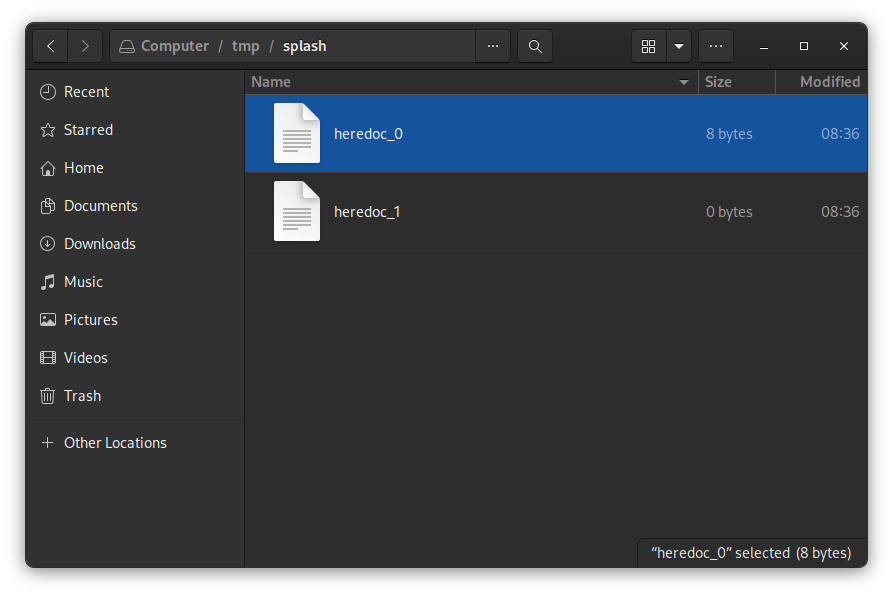
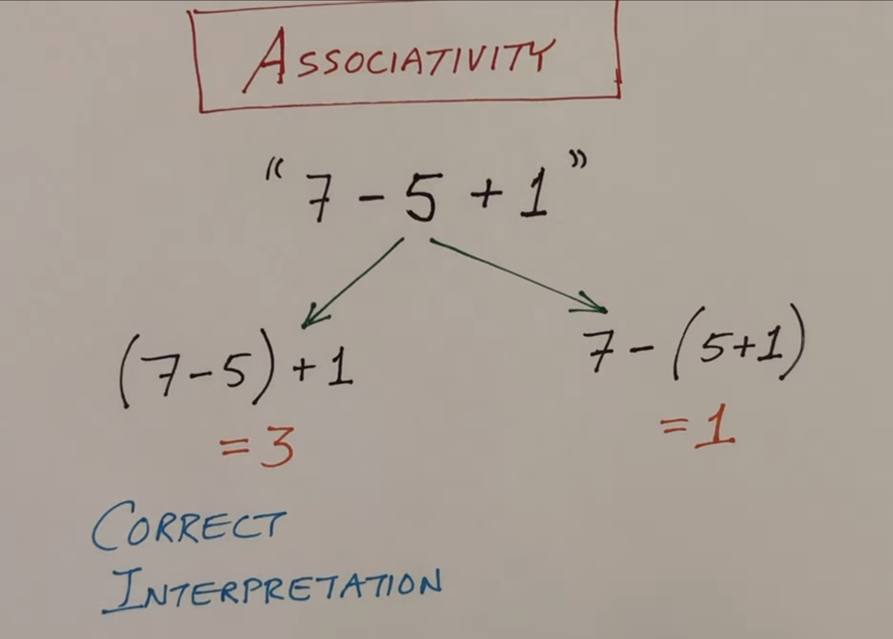

# Extras

## tgoto (not used in our shell)
The tgoto function is a part of the termcap library in Unix-like operating systems. It is used to generate movement strings for the terminal.

The termcap library provides a way to manipulate the terminal independent of its type. It has capabilities that describe the terminal's features and how to use them.

Here's the prototype for tgoto:
```
char *tgoto(const char *cap, int col, int row);
```
cap is a pointer to a string containing a cursor motion capability with two parameters. This is typically obtained from a call to tgetstr.
col and row are the column and row numbers (respectively) to which the cursor should be moved.
The function returns a pointer to a static area containing an escape sequence that will move the cursor to the specified position.

For example, if you have a terminal capability string for cursor motion like cm=\E[%i%d;%dH, you can use tgoto to generate a string that moves the cursor to a specific position:
```
char *cm = tgetstr("cm", NULL);
char *gotostr = tgoto(cm, 10, 20);
```

In this example, gotostr will contain an escape sequence that moves the cursor to column 10, row 20.

Please note that termcap is quite old and has largely been replaced by terminfo and the ncurses library, which provide similar functionality but are more powerful and flexible.

## The PWD builtin
[from a student at 42...]
I just realized how difficult the pwd builtin is if you want to make it behave like bash (some evaluators insist on taking bash as a reference when implementing the builtins). 
On shell startup:  
If: PWD is unset, set it to getcwd()  
Else If: PWD is set, but the directory described by PWD does not exist, set it to getcwd()  
Else If: PWD is set, but the directory described by PWD does not have the same inode number as the directory described by getcwd(), then set it to getcwd()  
Else: don't change it
Set a hidden variable to the value of PWD. It cannot be set or unset manually, only cd can change it  
When calling cd:  
Set PWD to the path requested (if chdir() was successful), instead of the value of getcwd()
On success, set the hidden variable to PWD
When calling pwd:  
Print the hidden variable, ignore the value of PWD or getcwd().  
This behavior mirror pretty much what bash's pwd builtin does, and it has the following implications:  
```
$ mkdir real real2 #create 2 directories (different inodes)
$ ln -s real fake  #symlink1 (inode of first dir)
$ ln -s real fake2  #symlink2 (inode of first dir)
$ cd fake && pwd  #set PWD to argument of cd, then print PWD instead of getcwd()
~/fake
$ unset PWD && pwd  #if we didn't have the "hidden" variable, this wouldn't work
~/fake
$ bash -c pwd  #inherits PWD (~/fake exists and has the same inode number as getcwd())
~/fake
$ PWD=/nonexistent bash -c pwd  #PWD doesn't exist, set to getcwd()
~/real
$ PWD=~/real bash -c pwd  #PWD exists and has same inode number, keep it
~/real
$ PWD=~/fake2 bash -c pwd  #PWD exists and has same inode number, keep it
~/fake2
$ PWD=~/real2 bash -c pwd  #PWD exists but doesn't have the same inode number, set to getcwd()
~/real
$ PWD= bash -c pwd  #PWD is unset, set to getcwd()
~/real
```
All minishells I've seen always print `~/real` (without the tilde of course) instead of the other cases. 

## Some Command Edge Cases
```
bash-3.2$ export myvar=`ls -l`
bash-3.2$ $myvar
bash: total: command not found
```
why this? When you try to use $myvar as a command, Bash attempts to execute the first word of myvar's value as a command. In this case, the first word is likely "total" (the first word in the output of ls -l), which is not a valid command, hence the error message "total: command not found".


```
bash-3.2$ export myvar=`ls -l`
bash-3.2$ $(ls)
bash: LICENSE: command not found
```

So, if the first file or directory listed by ls -l is LICENSE, Bash will try to execute LICENSE as a command, which is not valid, hence the error message "LICENSE: command not found".

If you want to store a command in a variable and then execute it, you should store the command as a string, not execute it and store the output. 

```
bash-3.2$ myvar="ls -l"
bash-3.2$ eval $myvar
```

## True and False
```
true
echo $?  # prints: 0

false
echo $?  # prints: 1
```
In Bash, true and false are commands, not boolean values like in many programming languages.

The true command does nothing and successfully completes immediately, returning a 0 exit status, which signifies success in Unix-like operating systems.

The false command also does nothing but it completes with a non-zero exit status, signifying failure.

## More Heredoc
(For others, the code they posted contains only double quotes, not single quotes)
We don't have to handle multiline delimiters in minishell.

E.g.:
```
$ wc -c << '
eof'
> whatever
> line2
>
>eof
```
Doesn't work, and neither does
```
$ wc -c << '
 eof'
 > whatever
 > line2
 >
eof
```
The difference in the two example is that in the former, I pressed enter on the empty line, and in the latter, I copied a newline followed by the string eof to the clipboard and then pasted it. This will make readline() return a multiline string.
Neither cases work.
We also don't have to handle empty delimiters
```
$ wc -c <<''
> something
>
10
```
Since this requires handling quotes around the delimiter, which is not required by the subject, and it would mean implementing different parsing rules, at which point you could go haywire and ask why not require <<- too.

## Using Files to Store the Heredocs
heredocs need to be run before the command execution so they need to be stored somewhere and a file is probably a good option. We decided to use the tmp folder on Linux to store the heredocs because it is a common practice and we have access to it from anywhere. I updated the makefile with:
```
TMP_DIR			= 	/tmp/splash/

# target
all: $(LIBFT) $(NAME) tests tests_integration
	mkdir -p $(TMP_DIR)
```
and it makes a directory if it not already exists. The files will be deleted when the program ends.

<div style="text-align: center;">

</div>

## The ioctl() System Call
To fix the issue with the signals in the heredoc we used the `ioctl` system call.  
`ioctl` stands for "input/output control" and is a system call in Unix-like operating systems. It provides a generic way to make device-specific calls on file descriptors, which might represent files, devices, or other types of I/O streams. The purpose of `ioctl` is to perform operations on a file descriptor that are not achievable with simple read or write commands, often because they involve hardware control or special modes of communication.

The signature of `ioctl` is typically as follows:

```c
int ioctl(int fd, unsigned long request, ...);
```

- `fd`: The file descriptor on which the operation is to be performed. This could be a descriptor for a device file, socket, or any other entity that can perform I/O operations.
- `request`: A device-specific request code that indicates the operation to be performed. These codes are usually defined in the device's header files.
- `...`: Zero or more additional arguments. The type and number of these arguments depend on the request code. They might be used to pass data to the device driver or to receive data from it.

The `ioctl` call returns an integer value. A return value of `-1` indicates an error, and `errno` is set to indicate the specific error.

`ioctl` is used for a wide range of purposes, including but not limited to:
- Querying or setting device parameters.
- Performing special control functions on devices, such as formatting or ejecting media.
- Enabling or disabling specific features of a device.
- Managing file or device locks.

We used `ioctl(0, TIOCSTI, "\n");` to simulate input in the terminal.

- `ioctl` system call, see above.
- The first argument `0` refers to the file descriptor for standard input (`stdin`).
- `TIOCSTI` is a command for the `ioctl` system call, which stands for "Terminal Input Control for STImulating input." It allows a process to insert bytes into the input queue of a terminal.
- The third argument `"\n"` is the character to be inserted into the terminal's input queue. In this case, it's the newline character.

So, `ioctl(0, TIOCSTI, "\n");` simulates pressing the Enter key in the terminal. This can be used in programs to automatically feed input to the terminal as if it was typed by the user. However, using this requires appropriate permissions, as it can pose security risks by allowing a process to inject commands into another user's terminal sessions.

## Precedences
the precedence of || and && in Bash and C is different.

In C, the '&&' operator has higher precedence than the '||' operator. This means that in an expression with both '&&' and '||', the '&&' parts will be evaluated first.

In Bash, however, '||' and '&&' have equal precedence and are evaluated from left to right.

In terms of precedence, in both Bash and C, '||' has lower precedence than '|' (in C '|' is a bitwise OR operator.).  
In Bash, it means that in an expression with both '|' and '||', the '|' parts will be evaluated first.
Here's an example of using '|' and '||' in Bash:
```
command1 | command2 || echo "command1 or command2" failed
```
In this example, the output of command1 is piped into command2. If either command1 or command2 fails, the message "command1 or command2 failed" is printed to the console.

## Associativity
This is about building the correct ast tree... the image is self explanatory. (image by hhj3 youtube)



## Display the stderr
A good idea is to display the std error with all the debug messages on a different window in the terminal. For this we have two ways:
```
./minishell 2> errorlogfile
```
and in another window do `tail -f errorlogfile"

Alternatively open a new window and get the terminal file name with `tty` and execute the shell with `./minishell 2> /dev/pts/5`

## Final notes
The line count for the project counting the c and h files is at the end stage before submission 12763:
```bash
find . -name '*.c' -o -name '*.h' | xargs wc -l
```

and including the cpp and hpp files 20385:

```bash
find . -name '*.c' -o -name '*.h' -o -name '*.cpp' -o -name '*.hpp' | xargs wc -l
```


## Teamwork - It's about git
Using a version control system (such as git and GitHub) was essential for productive team collaboration. It allowed us to work in parallel on features in different branches, flag and resolve issues and generally keeping track of the project and implementing changes without creating a mess. We learned a lot and adapted our workflow to our specific working styles.

### Commit Style
>  Treat your codebase like a good camper does their campsite: always try to leave it a little better than you found it.  - Bob Nystrom

For our commits we took first inspiration from the following, even if we implemented a reduced version for our purposes. We mostly used a commit style in the form of "KEYWORD \[scope\] commit message" and mostly used the keywords 'FEAT', 'FIX', 'DOCS' and 'REFACTOR'.

See https://www.conventionalcommits.org/en/v1.0.0/#summary.  

The commit message should be structured as follows:
```
<type>[optional scope]: <description>
[optional body]
[optional footer(s)]
```
The commit contains the following structural elements, to communicate intent to the consumers of your library (from the source):

- `fix:` a commit of the type fix patches a bug in your codebase (this correlates with PATCH in Semantic Versioning).
- `feat:` a commit of the type feat introduces a new feature to the codebase (this correlates with MINOR in Semantic Versioning).  
- `BREAKING CHANGE:` a commit that has a footer BREAKING CHANGE:, or appends a ! after the type/scope, introduces a breaking API change (correlating with MAJOR in Semantic Versioning). A BREAKING CHANGE can be part of commits of any type.  
- types other than fix: and feat: are allowed, for example @commitlint/config-conventional (based on the Angular convention) recommends build:, chore:, ci:, docs:, style:, refactor:, perf:, test:, and others.  
- footers other than BREAKING CHANGE: <description> may be provided and follow a convention similar to git trailer format.  
- Additional types are not mandated by the Conventional Commits specification, and have no implicit effect in Semantic Versioning (unless they include a BREAKING CHANGE). A scope may be provided to a commit’s type, to provide additional contextual information and is contained within parenthesis, e.g., feat(parser): add ability to parse arrays.  

## Git rebase
When working in a team and using git sometimes it is better to use rebase instead of merge.

Rebase is a Git command that allows you to integrate changes from one branch into another. It's often used to keep a feature branch up-to-date with the latest code from the main branch.

Here's a step-by-step explanation of how rebase works:

You have a feature branch that you've made some commits on.
The main branch receives new commits while you're working on your feature branch.
You want to include those new commits from the main branch into your feature branch.
You can use git rebase main while on your feature branch to do this.
What rebase does is it takes the changes made in the commits on your feature branch, and re-applies them on top of the main branch. This effectively moves or "rebases" your feature branch to the tip of the main branch.

The result is a cleaner history than merging. Instead of a merge commit, your feature branch will have a linear history that makes it look like you started working on it later than you actually did.

However, rebase can be more complex to use than merging, especially when conflicts occur. It's a powerful tool, but it should be used with understanding and care.
```
git pull --rebase
```
I also added it to my git aliases like
```
git config --global alias.pr 'pull --rebase'
```
If git pull rebase should fail, it is easy to back up with 
```
git rebase --abort
```
and pull normally or solve the conflicts.


## The status of the project at the time of the evaluation
In the end we really used 28 tokens we receive from the scanner.  
57 are recognized but not acted upon because they are related to features we do not implement.  
