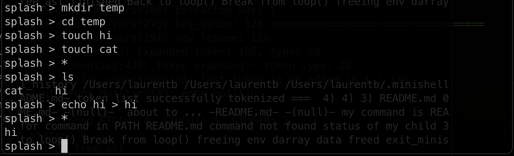

# Evaluation

## Colors in the prompt
It turned out that having colors in the prompt is a bad idea because due to the ansi excape codes the shell can't calculate the length of the prompt correctly. This leads to the cursor being in the wrong place when you press the arrow keys in some extra long commands or when copying and pasting.

We had this problem in the minishell. Since we changed the prompt at the end of the project, we did not expect that this would break things or have unexxpected consequenses. But it did. We had some tests failing and we had no idea why. 

We discussed it with our peers and found out that the bash would have the same behaviour.  
Our readline prompt:

```bash
data->input = readline("\033[44m\033[97m splash 💦 \033[0m\033[44m\033[97m>\033[0m ");
```
which looks like this: 
<div>
	
</div>

we can let bash do the same thing with the following command:
```bash
PS1="\033[44m\033[97m splash 💦 \033[0m\033[44m\033[97m>\033[0m "
```
and it would also have the same behaviour.
There are some functions that we are not allowed to use for this project that would fix the problem. But for now we will just make the prompt go over two lines. Since the terminal gui is getting confused by the ansi escape codes and prompt length, we will just make the prompt go over two lines. This way the bottom prompt will not have colors and be unaffected.

```bash
data->input = readline("\033[44m\033[97m splash 💦 \033[0m\033[44m\033[97m\033[0m\n>");
```

Now it looks like this:
<div>
	
</div>

## Bash ambiguous redirect
This is not a feature but in bash when you do this:

```bash
bash: A="one two"
bash: B="three four"
bash: echo hi>$A""''""$B
# you get:
bash: $A""''""$B: ambiguous redirect
```

In our minishell we actually create a file called "one twothree four" and write "hi" to it.  

```bash
export A="one two"
export B="three four"
echo hi>$A""''""$B
ls
```

This is good :) The reason for the bash behaviour is that it gives meaning to empty strings like `""` and `''`. We do not need to do it and out behaviour is expected.

also
```bash
echo "Hello, 
World!" | cat -e
# use ctrl-v and ctrl-j to get the newline
# should print the lines with a $ at the end
```		

## pipes

```bash
| | |
|||
||||||||||||||||||
```
## history of shells
It also good to know a bit of history ad how the shells have evolved.
See this page for some extra facts about the evolution of different shells. 
[https://www.in-ulm.de/~mascheck/bourne/](https://www.in-ulm.de/~mascheck/bourne/)

## look into your executables
So you compiled your minishell with makes. You have like 150 files into one, how to check if you used onluy nonn foridden functions?

```bash
nm -u ./minishell

# this is the output
_access
_add_history
_chdir
_close
_closedir
_dup
_dup2
_environ
_execve
_exit
_fork
_free
_getcwd
_getenv
_ioctl
_isatty
_malloc
_memcpy
_open
_opendir
_perror
_pipe
_printf
_read
_readdir
_readline
_rl_catch_signals
_rl_clear_history
_rl_on_new_line
_rl_redisplay
_rl_replace_line
_signal
_stat
_strcmp
_unlink
_waitpid
_write
```

The -u specifically looks for the functions which are `included`, so functions we get from c libraries and not the ones we created ourselves.

To know more about a specific function and where it is used you can use the following command:

```bash
grep -InR ioctl
```
The flags for `grep` in case you are curious are:
-I is an option that tells grep to ignore binary files.
-n is an option that tells grep to display line numbers along with the matching lines.
-R is an option that tells grep to search recursively in directories and subdirectories.

And since we are allowed to use one global variable only and for the signals only... of course our evaluator looks for it in in the repo with a simple command and why not use some color!

```bash
grep --color -InR '\<g_'
```

<div>
	
</div>

## The signals
in the minishell signals are implemented in three places. In the readline main loop where SIGINT will just redisplay the prompt and SIGQUIT will do nothing.
In the blocking child processes where SIGINT will kill the child and SIGQUIT will print the exit status of the child.

## file descriptors
In valgrind there is a flag to check the open file descriptors. This is useful to check if you are closing all the file descriptors you open. Also they usually dont add up like memory leaks but still in a process we can open only 1000 of them. It is a good thing to double check the usage on exit.
We use valgrind (on Linux only) to check for file descriptors. The flag is `--track-fds=yes`.
```bash
valgrind --track-fds=yes ./minishell
```
but since the readline has so many errors due to "unreachable" memory we managed a different incantation:
```bash
echo $'echo hi\nexit' | valgrind --track-fds=yes ./minishell
```
Bash interprets `echo $'echo hi\nexit'` as a 2 liner. So effectively sending `echo hi` and `exit` to our minishell. And valgrind will check after exiting how many file descriptors are open.

## quotes expansion

This should just do `ls -l`:  
```bash
"/bin/ls" "-l"''""''""
```
and so on, these are just `ls`:    
```bash
'/bin/ls'
'/bin/'""'ls'
'/bin/'""'ls'$EMPTY
'/bin/'""'ls'$EMPTY$AGAIN
```

This will give `$$/bin/ls: No such file or directory`
```bash
$$'/bin/'""'ls'$EMPTY$AGAIN
```
but this will work:  
```bash
$EMPTY'/bin/'""'ls'$EMPTY$AGAIN
```

Other tests:
```bash
echo '$USER'
# prints $USER
echo "$USER"
# prints the username

echo h^C
# redisplays the prompt
echo 'hey ' / cat -e
# checks for maintaining spaces in the single quotes
```

## the env builtin
In the subject it says we need to implement the env builtin. In bash `env` is a program.
So this makes sure we are not just executing the program `env` but also implementing the builtin.
```bash
env -i 
# prints too many args
/bin/env -i
# prints nothing
```

## export builtin
the identifiers can start with _ or a letter and can contain _ or a letter or a digit.  
```bash
export _A='"what"'
export A_A='"'
echo $A_A # prints "
export $42=42 # prints not a valid identifier

# in bash do export A="ae\"aeghoue" then 
echo $A

export export
export export=
echo $export
export export=a
echo $export
echo e=export
$e
# export command not found
export l=ls
echo $l
# prints the result of ls
export a=echo
$a
# prints echo
which echo
export k=cd
#cd command not found
export ^C=hi # ^C is not a valid identifier but to get ^C you need to press ctrl+v ctrl+c
```

## unset builtin
```bash
unset
unset a
unset wehtuogeth
unset -
unset [^[^
#syntax error
unset ^C 
unset unset unset
echo $? #should be 0
unset e la  la #EXPORT
```

## pwd builtin
```bash
pwd
echo $PWD
cd ..
cd .. ^C
pwd
echo $PWD
cd -
pwd
echo $PWD
echo OLDPWD
cd ../../.././/.././../..////
pwd
# shd be root
cd bin
pwd
echo $PWD
```
back to the shell directory
```bash
mkdir tmp
cd tmp
pwd
mkdir -p a/b 
cd a/b
ls -al
rm -rf ../../a
pwd # will get confused and not print anything
cd ..
pwd # should print the path again

.././././././.././././../. export A="../"^C
#syntax error
.././././././.././././../../bin/ls
# should print the content of the bin directory
$A.././././././.././././../../bin/ls
# should print the content of the bin directory
```

## Create random commands
There is the option in bash to create repeated letters with alt + 9. (Linux)
also playing with CTRL + V and CTRL + C can give you some interesting results.

## Verify the left to right order in path
In `home` dir create the tmp dir and in it create a file called grep and make it executable
with the #!/bin/bash as the first line and chmod +x grep
then run the following command
```bash
export PATH="$HOME/tmp:$PATH"
echo $PATH
cat $HOME/grep
#!/bin/sh
# echo PWNED
```
so when you run `grep` it should print `PWNED`. This shows that the order of the path is from left to right. Otherwise it woud have executed the grep command.

## Redirections
```bash
echo hi
echo hi > ho
cat ho
#hi
cat < ho
cat < ho >> ha
cat ha
#hi\nhi
nl ha > no
```

## heredoc
```bash
<<1
<<1 # ending with CTRL + D
```
and
```bash
<<1<<2<<3<<4
# then type CTRL + D 4 times
<<1≤<2<<3<<4 | <<5<<6<<7<<8
# then type CTRL + D 8 times
<bla <<1≤<2<<3<<4 | <<5<<6<<7<<8
<<''
#syntax error
cat<<a
# the type $HOME , a, and check the expansion
# when typing \$HOME the expansion doesnt happen
cat<<a''
# should work end with a
cat<<$a
#to end type $a
```

Tricky one:
In Bash the heredoc are processed before anything else but still when using the `&&` and `||` the variables are updated... This would work in case of the bonus being available
```bash
export NO=YES && cat << haha
# in the heredoc type $NO and verify it is yes
```

## bonus && and ||
```bash
export A=B && echo $A
# should print B
echo hi && echo ho
# should print hi and ho
echo hi || echo ho
# should print hi
echo hi && echo one && echo two && echo three
# should print hi one two three
echo hi && echo one && echo two && echo three || echo fail
# should print hi one two three
echo hi && echo one && echo t^C && echo three l| echo fail

false && echo one && echo two && echo three || echo fail || echo not this one && echo but this one
# should print fail but this one
false && echo one && echo two && echo three Il echo fail || echo not this one && echo but this ONE && false || hey || ho
# should print fail but this ONE and command not found hey
(((true|false) | false| true))
echo $?
(echo hi) > hi
cat hi

```
This would not work in bash because the parentheses are used for function blocks and not for subshells. But in our minishell it should work.
```bash
>what (echo hi)
cat what
# should print hi
```
in bash 
```bash
echo bla ›(rev)
#prints bla /dev/fd/12
```

The command `echo bla >(rev)` is using a feature called process substitution. It allows a process's input or output to be referred to using a filename. It's a way to use the output of a command as if it were a file. the shell starts the `rev` command and replaces `>(rev)` with a path to a file descriptor that is connected to the input of `rev`. This file descriptor is typically something like `/dev/fd/12`, which represents a temporary file descriptor that the shell has set up to capture the output.

## bonus parentheses
```bash
(echo hi) > hi | (sleep 1 && cat hi | nl)
# should print hi
```
## go crazy
```bash
dev/urandom| head -1alse && echo one && echo two && echo three || echo fail || echo not this one && echo but this ONE && false || hey || ho)|(((nl)))))))|x|x|x|x|echo hi | cat\
```
```bash
(((((false && echo one && echo two && echo three || echo fail || echo not this one && echo but this ONE && false || hey || ho) | (((nl)))))))|x|x|x|x|echo hi|cat /dev/urandom | head -l
```

## globbing
Ok this took me a moment to understand lol, but it worked!

```bash
echo *
# should print all the files in the directory
mkdir tmp
cd tmp
touch cat
touch hi
*
ls
cat hi
echo hi > hi
*
# should print hi
```
<div>
	
</div>

And this works too
```bash
>echo
>hi
echo *
# should print echo hi
*
# should print hi again
```